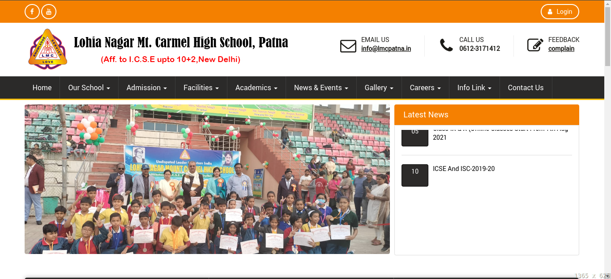
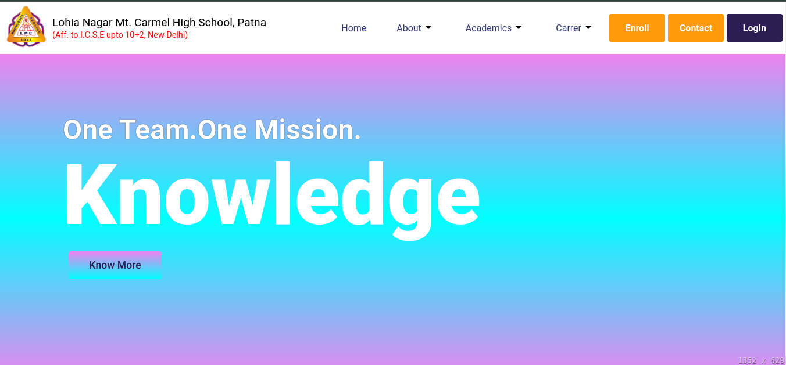
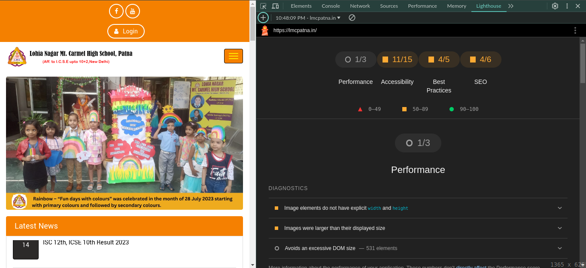
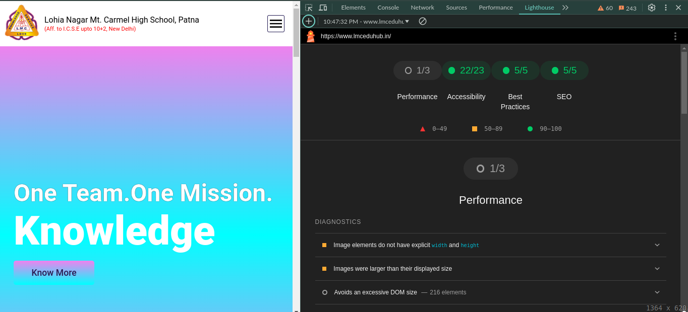
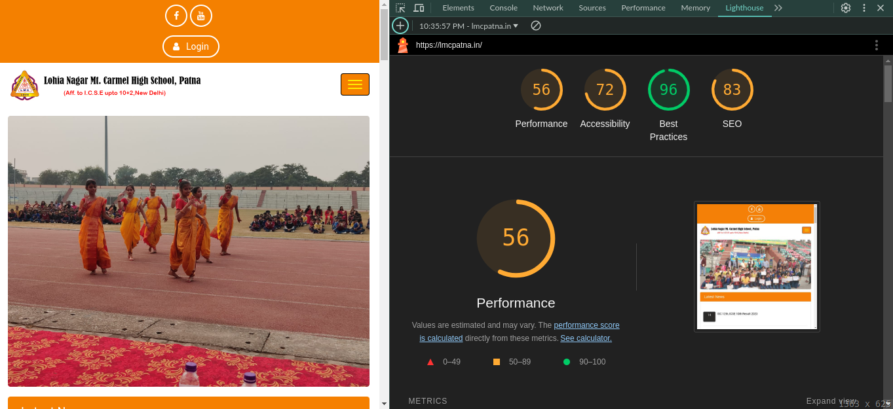
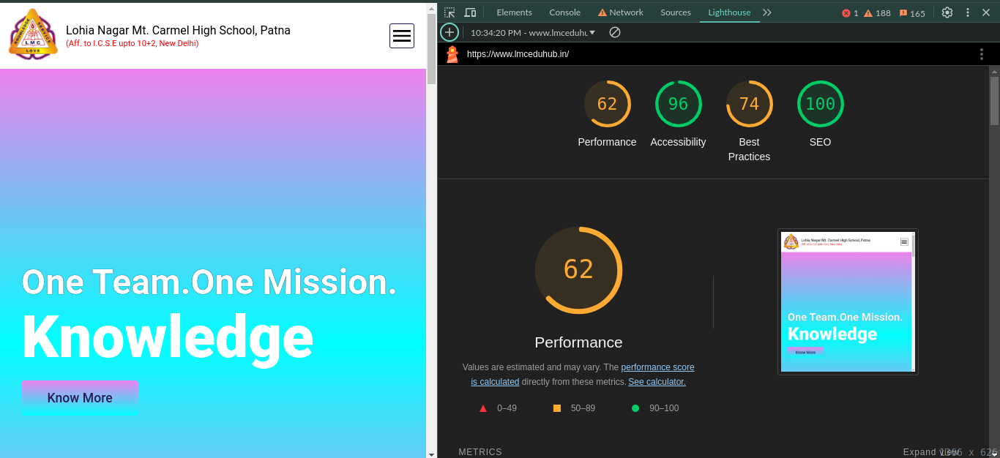

/**\*\***\*\*\*\***\*\***\*\*\***\*\***\*\*\*\***\*\***
<strong>Project - 01</strong> **\*\*\*\***\*\***\*\*\*\***\*\*\***\*\*\*\***\*\***\*\*\*\***/

# School Project

- Visit
  - [lmcSchool](https://www.lmceduhub.in/)

## Get an overview about the project

- Tech-stacks ::

  - Frontend Technologies

    - HTML
    - CSS
    - JavaScript

  - Backend Technologies
    - Node.js
    - Express.js
    - Cloudinary (Asset Management)
  - Database
    - NoSQL
      - MongoDB

- Deployment details ::
  - Note :- Both Frontend and Backend are deployed on different-different platforms.
  - Frontend
    - Vercel
  - Backend
    - AWS-EC2 instance
    - Nginx as a Proxy server

Note :- This website is hosted on a _AWS-EC2 instance under free-tier_. It will keep hosted until the free-tier will not get expired. (Haaaaaaaaaaaaaa........)

## At a glance

1. **UI**

- 
- 

2. **Snapshot Performance**

- 
- 

3. **Lighthouse Performance Result**

- 
- 

### Official site of the school

- [OldSite](https://lmcpatna.in/)

### Checkout the new website

- [NewSite](https://www.lmceduhub.in/)

/**\*\*\*\***\*\*\*\***\*\*\*\***\*\***\*\*\*\***\*\*\*\***\*\*\*\***\*\*\***\*\*\*\***\*\*\*\***\*\*\*\***\*\***\*\*\*\***\*\*\*\***\*\*\*\***/
