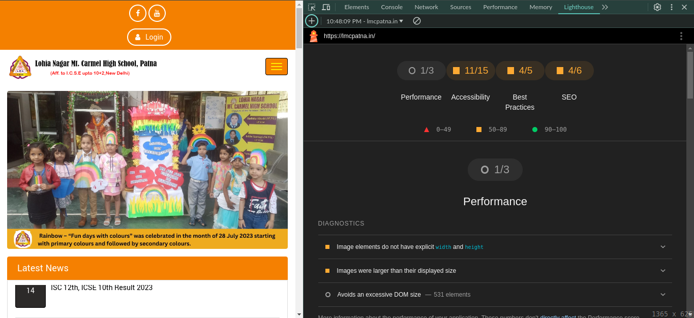
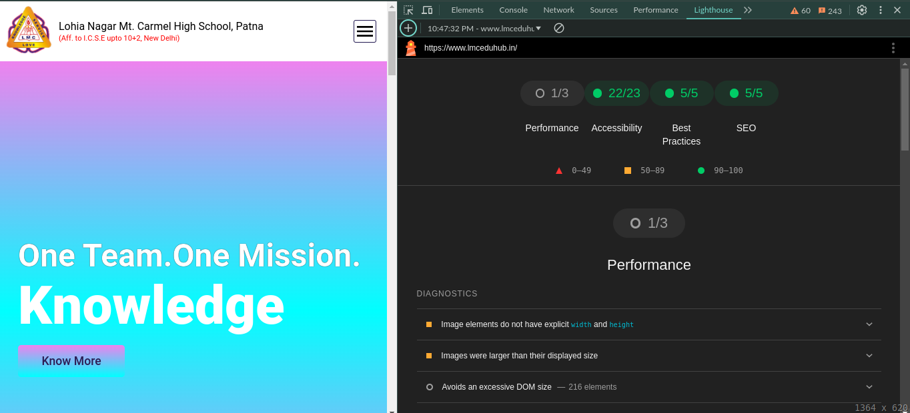
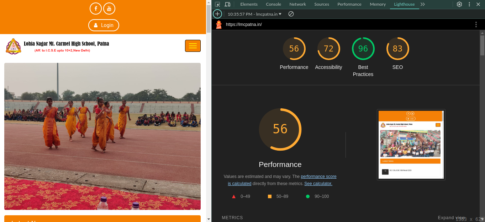
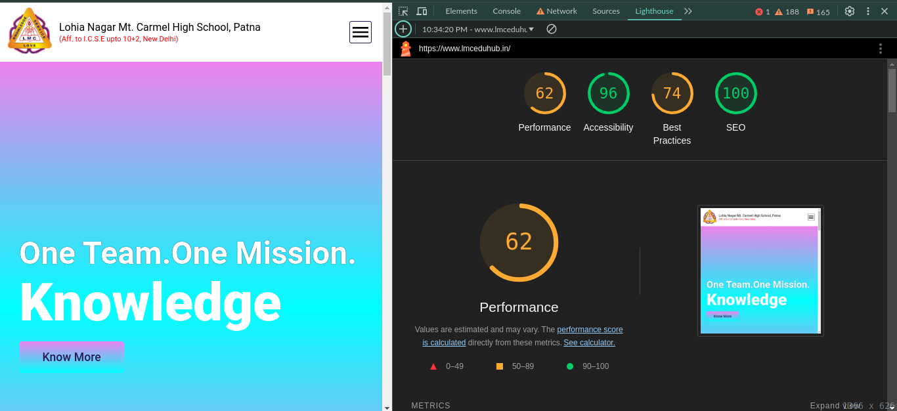

/**\*\***\*\*\*\***\*\***\*\*\***\*\***\*\*\*\***\*\***
<strong>Project - 01</strong> **\*\*\*\***\*\***\*\*\*\***\*\*\***\*\*\*\***\*\***\*\*\*\***/

# School Project

## Get an overview about the project

## Tech-stacks

- Frontend Technologies

  - HTML
  - CSS
  - JavaScript

- Backend Technologies
  - Node.js
  - Express.js
  - Cloudinary (Asset Management)
- Database

  - NoSQL
    - MongoDB

- Deployment details ::
  - Note :- Both Frontend and Backend are deployed on different-different platforms.
  - Frontend
    - Vercel
  - Backend
    - AWS-EC2 instance
    - Nginx as a Proxy server

Note :- This website is hosted on a _AWS-EC2 instance under free-tier_. It will keep hosted until the free-tier will not get expired. (Haaaaaaaaaaaaaa........)

## At a glance

### 1. **_UI (User Interface)_**

- 
- 

### 2. **_Snapshot Performance_**

- 
- 

### 3. **_Lighthouse Performance Result_**

- 
- 

## Links

- <a href="https://lmcpatna.in/" target="_blank">Visit the official site</a>
- <a href="https://www.lmceduhub.in/" target="_blank">Visit the new site</a>

/**\*\*\*\***\*\*\*\***\*\*\*\***\*\***\*\*\*\***\*\*\*\***\*\*\*\***\*\*\***\*\*\*\***\*\*\*\***\*\*\*\***\*\***\*\*\*\***\*\*\*\***\*\*\*\***/
